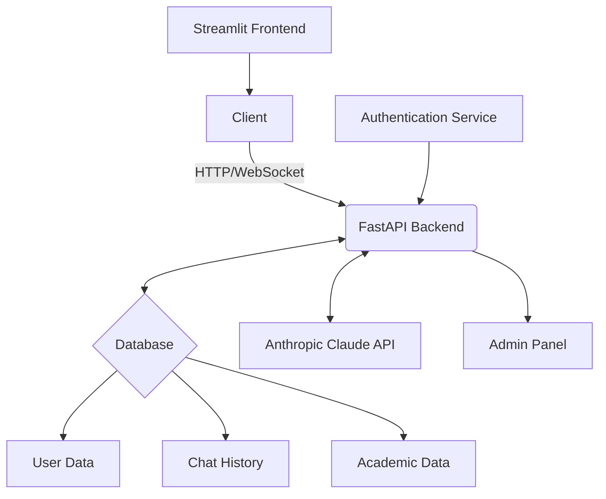

# IqroAI Project Documentation

## 1. Full Name of the Work
Design, development, implementation, and technical support of the IqroAI educational platform.

## 2. Team Name and Technology Stack

### Team Members
[List of team members participating in the project]

### Technology Stack
- Backend: Python (FastAPI)
- Frontend: Streamlit
- Database: SQLite
- AI Model: Anthropic's Claude API (claude-3-5-sonnet-20240620)
- ORM: SQLAlchemy
- Authentication: JWT (JSON Web Tokens)
- Admin Panel: SQLAdmin

## 3. Purpose of the Project
The primary objective of IqroAI is to create an intelligent, personalized educational assistant for students in Uzbekistan. The platform aims to provide tailored learning support, progress tracking, and adaptive content delivery to enhance the educational experience and outcomes for Uzbek students.

## 4. Conceptual Model

### Main Components
- Home
- Chat Interface
- User Profile
- Academic Reports
- Login/Registration
- Languages (Uzbek, Russian, English)

### 4.1. Functional Requirements

1. AI Assistant:
   - Provides personalized educational support based on user context and chat history.
   - Generates and evaluates academic and psychological tests.
   - Offers emotional support and motivation aligned with the student's psychological profile.

2. User Management:
   - User authentication and authorization system.
   - User registration for students, parents, and teachers.
   - Profile management for users.

3. Multi-language Support:
   - Supports Uzbek, Russian, and English languages.
   - Language selection option for users.

4. Academic Features:
   - Subject management and content delivery.
   - Student progress tracking and reporting.
   - Test generation and evaluation.

5. Chat System:
   - Real-time chat interface with AI assistant.
   - Chat history management.

6. Reporting:
   - Generation of academic reports and performance analysis.

7. Admin Panel:
   - Management of users, subjects, tests, and other system entities.

### 4.2. Application Structure Requirements

1. Authentication:
   - Custom authentication system using JWT tokens.
   - Secure password hashing using bcrypt.

2. AI Integration:
   - Integration with Anthropic's Claude API for AI-powered responses.
   - Real-time streaming of AI responses in the chat interface.

3. Database:
   - SQLite database for data storage.
   - SQLAlchemy ORM for database operations.

4. API:
   - RESTful API endpoints for various operations.
   - Streaming responses for AI assistant chat.

5. Frontend:
   - Streamlit-based user interface.
   - Responsive design for various devices.

6. Data Management:
   - CRUD operations for various entities (users, subjects, tests, etc.).
   - Efficient data retrieval for AI context building.

### 4.3. User Classes

1. Student:
   - Primary users of the platform.
   - Access to educational content and AI assistance.
   - Can take tests and view their progress.

2. Teacher:
   - Can view student progress.
   - Ability to contribute to educational content.

3. Parent:
   - Can view their child's progress and reports.

4. Administrator:
   - Full access to the admin panel.
   - Manages users, subjects, tests, and other system entities.

## 5. Project Diagram

This diagram illustrates the high-level architecture of the IqroAI system, showing the main components and their interactions.

## 6. Integrations

1. Anthropic Claude API:
   - Integration for AI-powered responses and analysis.
   - Used for generating personalized educational content and answering student queries.

2. Future Potential Integrations:
   - Integration with Uzbekistan's educational systems or databases.
   - OneID system for user authentication (if required in the future).

## 7. Additional Information

### 7.1. Data Models

The system uses the following main data models:

1. User
2. Parent
3. Teacher
4. Subject
5. ScheduleAndBooks
6. Test
7. TestResult
8. PsychologicalAssessment
9. StudentProgress
10. Chat
11. Message
12. StudentReport

### 7.2. API Endpoints

The system provides various API endpoints for different functionalities, including:

- User registration and authentication
- CRUD operations for subjects, tests, and other entities
- AI assistant interaction
- Report generation
- Chat management

### 7.3. AI Assistant Functionality

The AI assistant is designed to:

- Provide personalized learning support
- Generate and evaluate tests
- Offer emotional support and motivation
- Adapt to the student's learning style and interests
- Consider the student's grade level and subject matter

### 7.4. Security Measures

- JWT-based authentication
- Secure password hashing
- Role-based access control
- Data validation and sanitization

### 7.5. Scalability and Performance

- Asynchronous request handling with FastAPI
- Efficient database queries using SQLAlchemy
- Streaming responses for AI interactions

### 7.6. Cultural and Educational Context

- The system is tailored for the Uzbek educational system
- Content and interactions respect Uzbek cultural values and traditions
- Support for multiple languages (Uzbek, Russian, English)

### 7.7. Future Enhancements

- Integration with national educational databases
- Advanced analytics and reporting features
- Mobile application development
- Expansion of subject coverage and educational content

## 8. Sources of Information and Additional Requirements

To successfully implement the IqroAI project, the following sources of information and additional requirements are necessary:

1. Uzbekistan Educational System:
   - Detailed information about the curriculum structure for different grades
   - National educational standards and guidelines
   - Assessment methods and grading systems used in Uzbek schools

2. Textbooks and Learning Materials:
   - Access to official textbooks used in Uzbek schools for various subjects and grades
   - Supplementary learning materials approved by the Ministry of Education

3. Cultural Context:
   - Information on Uzbek cultural norms, values, and traditions relevant to education
   - Guidance on appropriate language use and communication styles

4. Psychological Assessment:
   - Standardized psychological assessment tools suitable for students
   - Guidelines for interpreting and using psychological data in an educational context

5. Data Privacy and Security:
   - Uzbekistan's data protection laws and regulations
   - Best practices for handling student data and ensuring privacy

6. Language Resources:
   - Comprehensive Uzbek, Russian, and English language resources
   - Translation and localization guidelines

7. AI Ethics and Guidelines:
   - Ethical guidelines for AI use in education, particularly for younger students
   - Best practices for AI-human interaction in educational contexts

8. User Experience Research:
   - Studies on effective UI/UX design for educational platforms
   - Insights into the digital literacy levels of the target user groups in Uzbekistan

9. Technical Documentation:
   - Detailed documentation for all APIs and libraries used in the project
   - Best practices for implementing the chosen technology stack

10. Educational Psychology:
    - Research on effective learning strategies and methodologies
    - Information on adapting teaching methods to different learning styles

## 9. MVP Information

### MVP Link
[[Insert MVP link here when available]](https://iqro-ai.streamlit.app/)

### Current MVP Database Status
The current MVP database contains a limited dataset for testing purposes:

- Data is available for 10 classes only
- Textbooks and timetable information are specific to:
  - Secondary School No. 3
  - Uchkurgon district, Namangan region
  - Specifically, the 10-A class timetable is included

This limited dataset allows for initial testing and demonstration of the system's capabilities. As the project progresses, the database will be expanded to include a comprehensive set of data covering all grades, subjects, and a wider range of schools across Uzbekistan.

## 10. Conclusion

This documentation provides a comprehensive overview of the IqroAI project, its architecture, and key components. It serves as a foundation for further development and can be expanded as the project evolves. The inclusion of specific data sources, additional requirements, and MVP information ensures a clear understanding of the project's current status and future needs.
